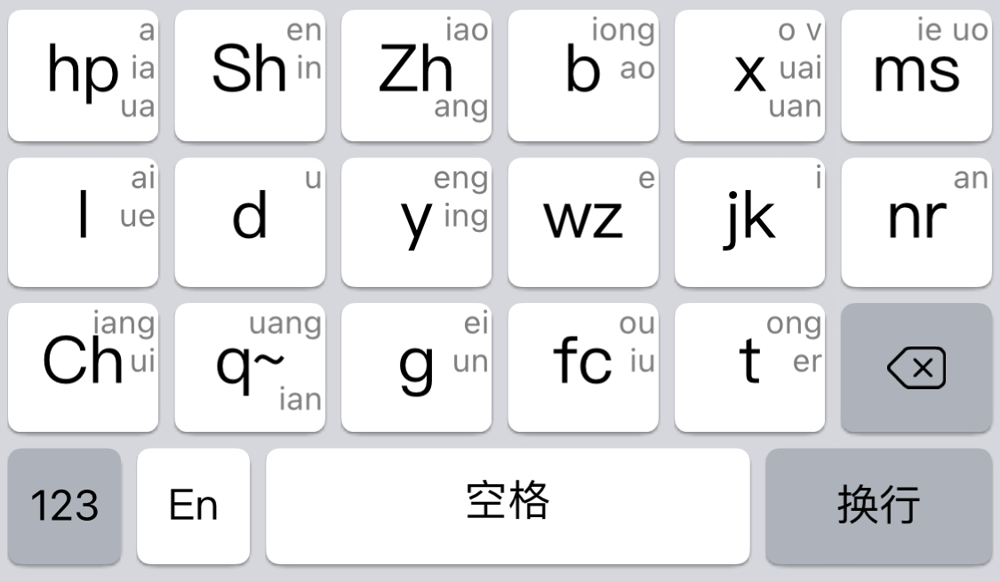

# 什么是 落格十七？

## 一种特殊的双拼键盘布局

“落格十七”是一种特殊的键盘布局，它脱胎于“乱序17键双拼”方案。它是一个介于双拼和全拼之间的拼音解决方案，它比双拼更容易上手，但又比普通 26 键全拼更适合移动端输入；虽然比九宫格上手的难度要大了一些，但又远远比之高效，是输入效率与学习难度之间的完美平衡。

### 按键大

对于拇指粗的人来说，26 个小按钮可能打起字来捉襟见肘，既想拥有低重码率的输入方案，又想要拥有更大的按键面积以减少误触，落格十七可能是你完美的选择，它通过精心编排的声母、韵母组合，在减少按键数量后做到了尽可能低的重码率，再加上更大的按键面积，再也不用担心误触重打了。

### 重码低

相对九宫格或者是传统的“双键”布局来说，落格十七通过独特设计的声韵组合实现了更低的重码率，而不是单纯地将按键信息进行混合检索，在减少按键数量增加按钮面积的同时，也尽可能地将重码率维持在了一个较低的水平。

### 全新的键盘布局

由于不是 26 键布局，也不是大部分人都听说过的“九宫格”布局，上手还是有一些学习成本的，相对 26 键来说，还是要更简单一些，总的来说，愿意尝试的话难度还是不大的。

## 基本使用规则

总的来说，任何会使用拼音输入的人都能很快上手 落格十七，落格十七使用两个按键组合一个拼音，比如你要输入“落格”，那么就依次按下`l,ms,g,wz`即可。键盘上显示的字母就是声母所在按键，有两个字母的，除了`zh`、`ch`、`sh`外，都表示两个声母，即`wz`键既可以用作声母`w`，也可以用作声母`z`，如此一来，按下声母后，再找韵母对应的按键（通常就是韵母，这里指除了声母外剩余的部分），就完成了一个拼音的输入。

特殊的：当遇到`a``en``ao`等单独能成拼音的韵母时，需要使用带有`~`符号的`q~`按钮作为一个“不存在的声母”，相当于双拼里的“零声母引导符”，这样就保证了遇到此类拼音时不会打破双拼两个按键一个拼音的规则。

> 注意：当启用落格十七键盘布局时，落格输入法中的“拼音方案”相关定义不生效，因为落格十七是一个布局和方案配套的独立输入解决方案；同理，码表设定也不会生效。

### 点划引导

落格十七 支持点划，但由于按键数量少，则以按键上字母最左侧的字母为准来兼容普通点划配置，比如`hq`按钮的点划，就以 26 键键盘的`q`键生效，当用户选择“落格十七”键盘布局时，落格输入法会自动生成并切换一套适应落格十七键盘布局的点划配置，用户可参照其设置进行自定义。

### 辅码筛选

落格十七布局带有两套辅码，一套音托辅码（落格十七-自然码辅码），一套形托辅码（落格十七-小牛辅码），其中音托辅码源自于“自然码”辅码，形托辅码源自于“小牛辅码”，用户可在落格输入法“辅码码表”相关设置中切换生效。

#### 落格十七-自然码辅码

落格十七-自然码辅码是双辅音托辅码，源自落格输入法内置的“自然码辅码”，基本规则不变，但有几点特殊之处需要注意：

1. `zh` `ch` `sh` 三个声母直接使用对应按键，而不是原自然码辅码中对应的按键映射`v`、`i`、`u`；
2. 对于辅码中有需要输入`a`、`o`等字母的情况，则直接按该韵母所在按键，比如`a`就是`hp`按键。

#### 落格十七-小牛辅码

落格十七-小牛辅码是双辅形托辅码，源自落格输入法内置的“小牛辅码”，基本规则不变，但有几点特殊之处需要注意：

1. 生效字母以按钮上左侧字母为主，比如`sh`和`ms`键都有`s`，我们以`sh`键生效；
2. 对于辅码中有需要输入`a`、`o`等字母的情况，则直接按该韵母所在按键，比如`a`就是`hp`按键。

### 辅码的重码问题

虽然相对原本 26 键辅码来说，处理之后的辅码重码量大大提升，但作为候选词筛选之用，效果依旧显著。
