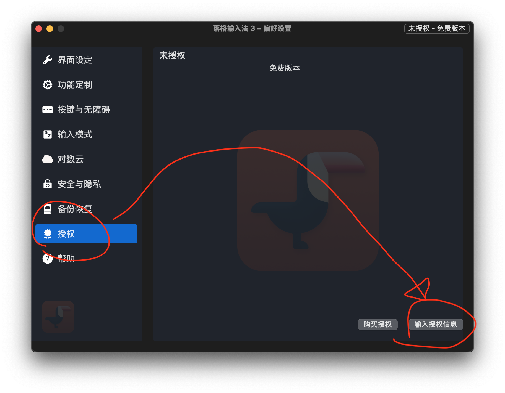
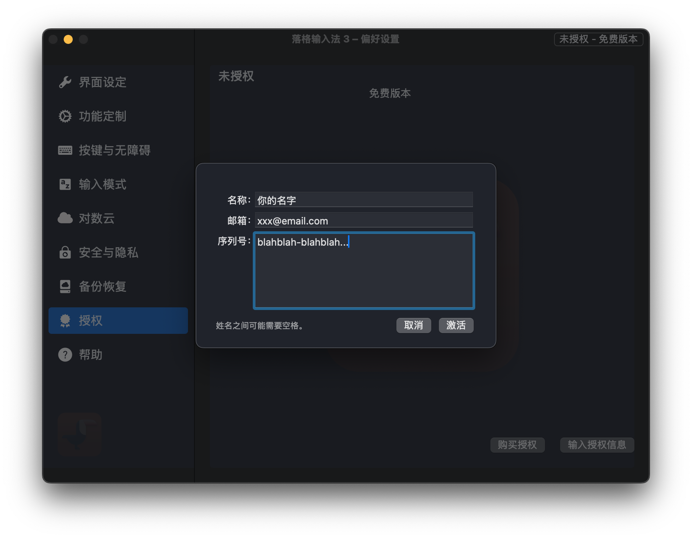
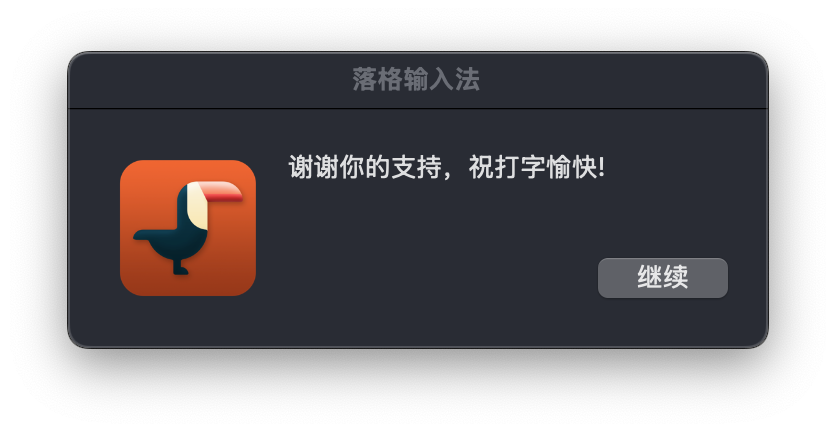

# 🪪 如何激活落格输入法 macOS？

首先确保你成功安装并能供运行落格输入法正常打字。

然后打开落格输入法的设置App

在设置App左侧找到“授权”选项卡

然后在弹出的界面输入你购买邮件中包含的姓名、邮件地址以及激活码：

> 注意：三者一定要匹配，否则无法激活。

一旦激活成功，你将看到如下弹窗：

## 激活信息不匹配...

有一些常见的情况会导致激活出错，比如你的姓名没有与购买时填如的相匹配。

如果你是在 数码荔枝软件商城 购买的落格输入法 macOS 激活码，则姓和名之间可能需要用空格连接

另外激活邮箱填错也是常见的错误之一，因为注册的时候就填错了，所以激活时也需要使用错误的那个邮箱地址来激活。请仔细比对激活邮件中的邮件地址。

激活码不匹配的情况相对较少但也有出现，大多是因为复制粘贴的时候不小心加入了空格等不可见符号。
由于这东西有点长，请小心选中再粘贴。必要的话先把它粘贴到一个纯文本的编辑器中，再复制粘贴到落格输入法的激活窗口中。