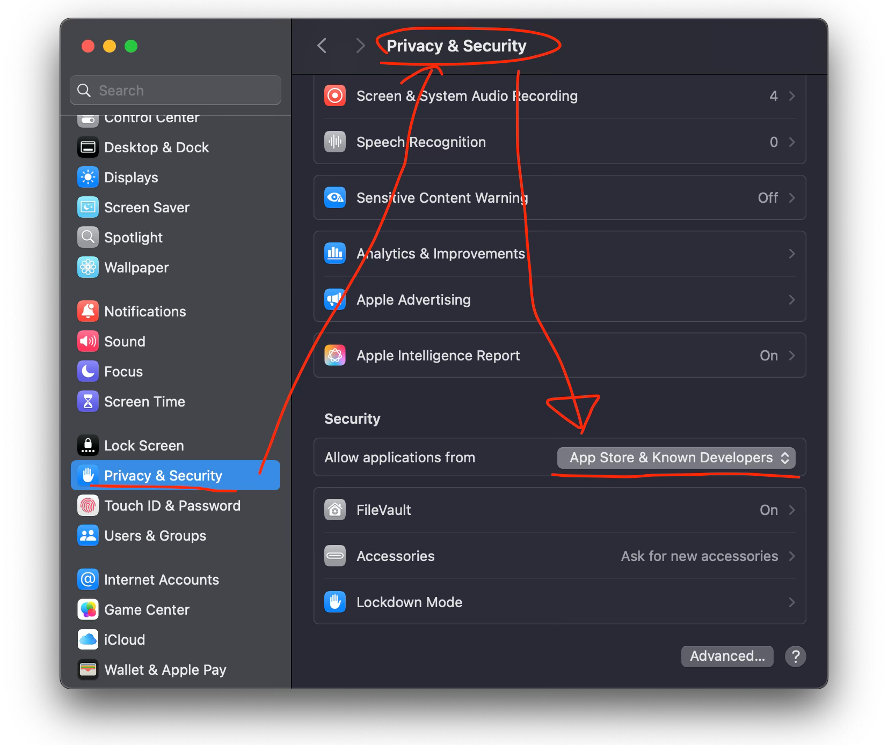
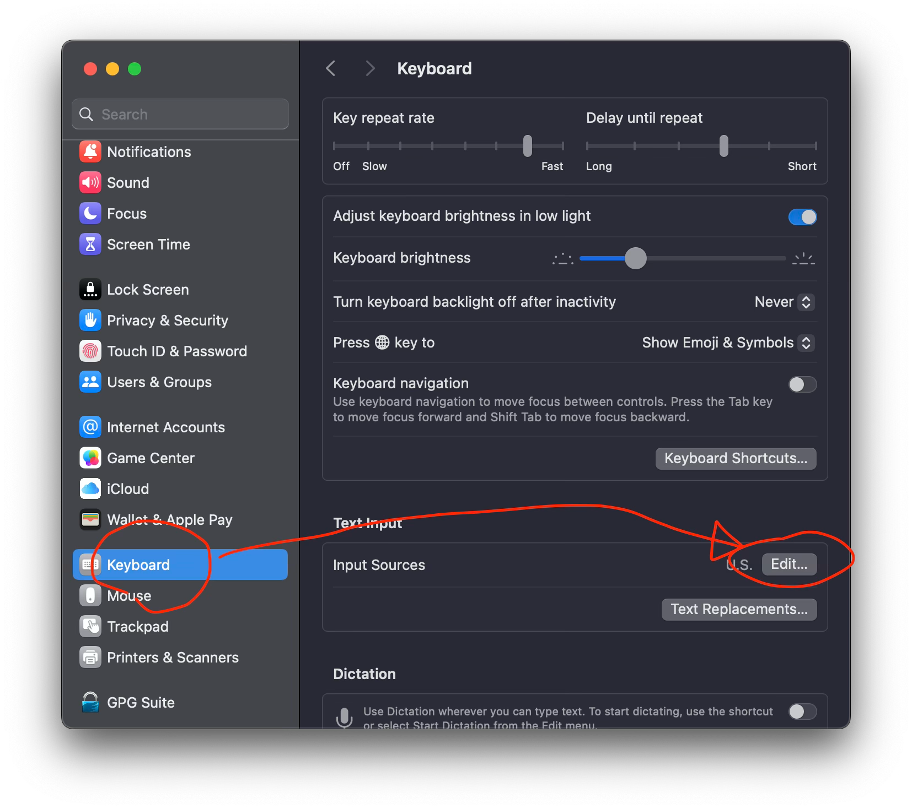
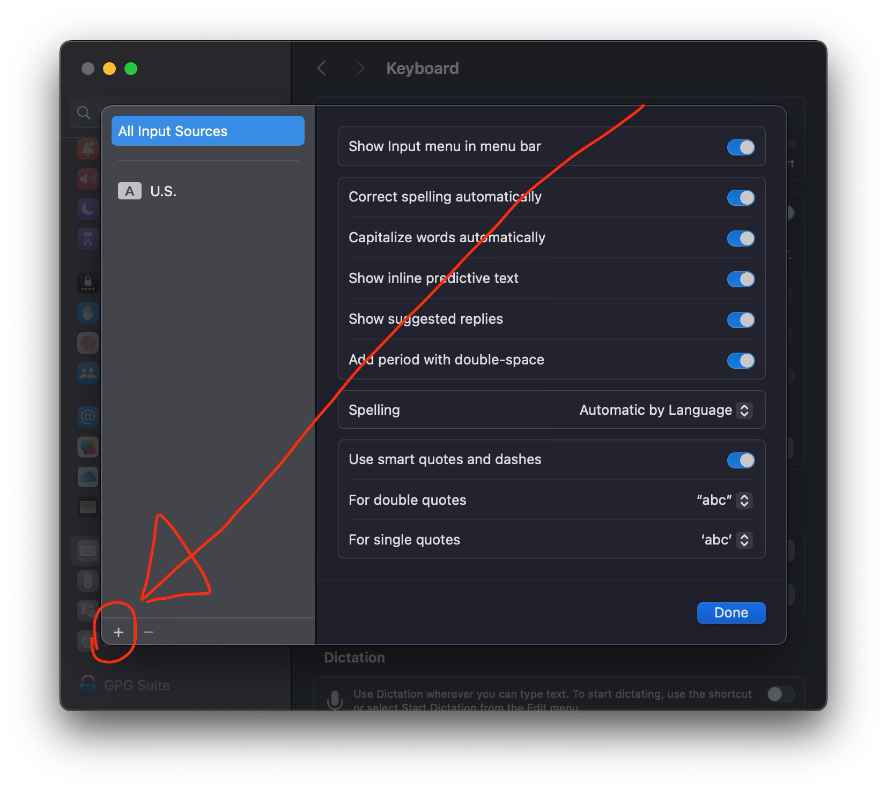
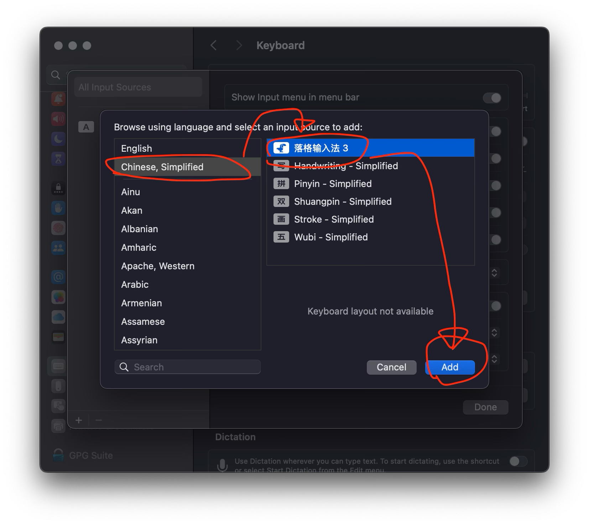
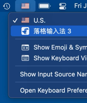

# ✨如何安装和使用落格输入法？

首先，在“系统偏好设置”-“允许从以下位置下载的应用”中选择“App Store 和被认可的开发者”。

接下来在安装落格输入法后，来把它添加到系统中：

首先在系统偏好设置中左侧滚动找到“键盘”，然后在右侧找到“文本输入”这一栏，在里边点“编辑”，然后在弹出的窗口左下角找到加号“+”按钮：

最后在弹出的窗口中左侧选“中文，简体”，右侧选“落格输入法”，点添加：

最后的最后，在设置菜单切换输入法到落格输入法。

> 注意：🚧 如果系统询问你是否允许落格输入法访问“文稿/Documents”文件夹，请选择允许，落格输入法不是要看你的文件，是要在这个目录创建用户文件目录，输入法自带的双拼方案以及码表文件都会存放到那里。后续你也可以在输入法的设置中修改用户目录的位置。
